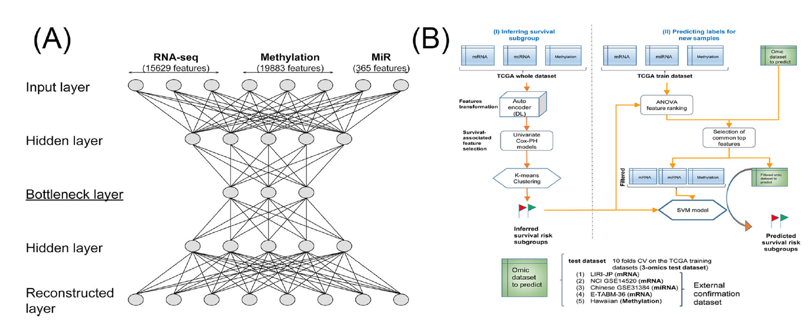

# Deep Learning based multi-omics integration


The project is aim to use Deep learning methods on Omics-data, including RNA-seq, copyNumber,  methylation_450 and protein_RPPA to find prognostic biomarkers which contribute to improve the survival rate in Kidney renal clear cell carcinoma   


### Workflow

The overall workflow which designed in the *Deep Learning based multi-omics integration robustly predicts survival in liver cancer*.



(A) Autoencoder architecture used to integrate 3 omics of HCC data. 

(B) Workflow combining deep **learning and machine learning techniques** to predict HCC survival subgroups. The workflow includes two steps. 

**Step 1:** inferring survival subgroups. In step 1: mRNA, DNA methylation and miRNA features from TCGA HCC cohort are stacked up as input features for **autoencoder**, a deep learning method; then each of the new, transformed features in the bottle neck layer of autoencoder is then subject to **single variate Cox-PH models**, to select the features associated with survival; then **K-mean clustering** is applied to samples represented by these features, to identify survival-risk groups.

**Step 2:** predicting risk labels for new samples. In step 2, mRNA, methylation and miRNA input features are ranked by **ANOVA test F-values**, those features that are in common with the predicting dataset are selected, then top features are used to **build SVM model**(s) to predict the survival risk labels of new datasets.


### DataSet

we used keywords "Kidney renal clear cell carcinoma" and "omics-data" for searching the expression data on TCGA website, and finally got more than 200 cases which comprised of four expression data types. At the same time, we also found that the most cases only had one or two data types, and we would like to perform validation test on these datasets when the biomarkers could be found.  

**TCGA-KIRC, Kidney renal clear cell carcinoma, about 70% of kidney cancers is made up of this type**.

| Dataset                                       | DataType                                                     | Number | Common_Number | Union_Number |
| --------------------------------------------- | ------------------------------------------------------------ | ------ | ------------- | ------------ |
| TCGA-KIRC (Kidney renal clear cell carcinoma) | Rna-seq                                                      |        | 290           | 1080         |
|                                               | copyNumber                                                   |        | 290           | 1080         |
|                                               | methylation_450                                              |        | 290           | 1080         |
|                                               | [protein_RPPA](https://www.mdanderson.org/research/research-resources/core-facilities/functional-proteomics-rppa-core.html) |        | 290           | 1080         |
|                                               |                                                              |        |               |              |


### The Project Structure

* **Assay**: the analysis directory 
* **Study**: the  files involved in the project, such as papers and rawdata per subdir
* **Result**: the results per procedure in the Assay directory 

```bash
KIRC/
├── Assay
│   ├── 00.preprocess
│   │   ├── preprocess.Rmd
│   │   └── preprocess.nb.html
│   ├── 01.phenotype
│   │   ├── phenotype.Rmd
│   │   └── phenotype.nb.html
│   ├── 02.autoencoder
│   │   ├── autoencoder.Rmd
│   │   └── autoencoder.nb.html
│   ├── 03.survival_analysis
│   │   ├── survival.Rmd
│   │   └── survival.nb.html
│   ├── 04.clustering
│   │   ├── clustering.Rmd
│   │   └── clustering.nb.html
│   ├── 05.ANOVA
│   │   ├── ANOVA.Rmd
│   │   └── ANOVA.nb.html
│   └── 06.Classification
│       ├── Classification.Rmd
│       └── Classification.nb.html
├── README.md
├── Result
│   ├── ANOVA
│   │   ├── copyNumber_anvoa.csv
│   │   ├── geneExp_anvoa.csv
│   │   ├── methylation_anvoa.csv
│   │   └── protein_RPPA_anvoa.csv
│   ├── feature
│   │   ├── Autoencoder_Remain_features.csv
│   │   ├── all_top_feature.csv
│   │   ├── all_top_feature_phen_normalization.csv
│   │   ├── copyNumber_top_feature.csv
│   │   ├── geneExp_top_feature.csv
│   │   ├── methylation_top_feature.csv
│   │   ├── protein_RPPA_top_feature.csv
│   │   └── survival_AEfeatures.csv
│   ├── figure
│   │   └── cluster
│   ├── phenotype
│   │   ├── all_survival_data.tsv
│   │   ├── common_survival_data.tsv
│   │   └── phenotype_cluster.csv
│   └── profile
│       ├── All_filter_merge_profile.tsv
│       ├── Autoencoder_top100_features.csv
│       ├── Autoencoder_top100_newfeatures.csv
│       ├── PanXingxin
│       ├── copyNumber_filter.tsv
│       ├── geneExp_filter.tsv
│       ├── methylation_filter.tsv
│       └── protein_RPPA_filter.tsv
├── Study
│   ├── Phenotype
│   │   ├── KIRC_clinical__information.csv
│   │   └── KIRC_clinical__nationwidechildrens.org_clinical_patient_kirc.txt
│   ├── RawData
│   │   ├── 1080samples_expression_rawdata.txt.gz
│   │   ├── 290samples_expression.txt
│   │   └── work.sh
│   ├── Reference
│   │   ├── 180979_3_supp_4273546_swcw41.pdf
│   │   ├── 180979_3_supp_4273548_qwcw41.xlsx
│   │   ├── 180979_3_supp_4273549_ywcw41.xlsx
│   │   ├── 180979_3_supp_4273551_gwcw41.xlsx
│   │   ├── 180979_3_supp_4273553_2whf12.docx
│   │   ├── 180979_3_supp_4273554_lwhf1l.docx
│   │   ├── 2019 - Deep Learning based multi-omics integration robustly predicts survival in liver cancer.pdf
│   │   └── articles
│   └── Script
│       ├── ModuleBBB.R
│       ├── Module_A.R
│       └── data-KIRC.R
├── mindmap_workflow.emmx
└── workflow.png

22 directories, 54 files
```


### To to list:

In order to discover the potential biomarkers, first and foremost we should do some preprocess on data:

1. preprocess data, including normalization or remove samples or genomic features
2. feature dimension reduction from bottleneck layer in autoencoders 
3. significant features selected from reduced features based on Cox-PH
4. classification by machine learning algorithm
5. compared with iCluster/PCA/sole feature to Autoencoder
6. integrating clinical parameters into omics-data to predict on survival analysis 
7. differential expression gene and functional analysis


### Data Analysis : Current Progress 

#### Preprocess Download TCGA expression profile and clinical parameters 

After downloading the data, We firstly chosen the suitable data with following criterions:

*  All of four expression profile format  have been appeared in all the samples
* Filtering the features of matrix and the samples with occurrence threshold parameters on expression profile
* Obtain the overall survival times and status from the raw clinical table
* Finally, the input files for autoencoder and follow data analysis have been prepared, such as four trimmed expression profile and one formatted clinical phenotype table 

#### Autoencoder 

put the expression profile which column is four types featureid and row is sampleid into the autoencoder model. Setting the bottleneck layer as 100, then the new 100 features were generated by this algorithm. The performance of this model showed very well 

#### Features associated with survival

performing univariate Cox-PH regression on each of the autoencoder features to identify the significantly associated with the survival with FDR less than 0.01.

#### K-means clustering 

The significantly associated with overall survival  auntoencoder features were used in k-means clustering and we identified the optimal Number of clusters based on two condition, one is the silhouette index and Calinski-Harabasz, the other is the significance of log-rank pvalue among clusters.

#### ANOVA

the subpopulation determined above as the labels via k-means clustering algorithm to do the ANOVA on 4-omics data and ranking the features by their adjust P value. 

* top 100  mRNAs
* top 100 CopyNumber
* top 50 DNA Methylation
* top 20 protein_RPPA : Reverse Phase Protein Arrays 

#### Classification model 

Choose the cluster labels and the top K features from 4-omics selected by ANOVA for support vector machine-based classification in full 287 samples. 5-folds cross validation and normalization on omics data are necessary before building the model.  In addition,  there are three metrics used to assess or evaluate the accuracy of the survival predication: Concordance index, Log-rank p-value of Cox-PH regression and Brier score.  

* Algorithm: 

  * Bayesian (Stacking)
  
  * RandomForest (Bagging)
  
  * Logistic Regression (Stacking)
  
  * Support Vector Machines (Stacking)
  
  * Stochastic Gradient Boosting (Boosting)
  
  * Ensemble Model
  
* Normalization:

  * Median scale normalization for 1st step 
  
  * Robust scale normalization for mRNA and DNA methylation data 
  
  * Unit scale normalization for CopyNumber and Reverse Phase Protein Arrays (protein RPPA)
  
  * Rank normalization for predicting a single sample
  
* Cross validation

  * method: repeated cv 
  
  * times: 3 
  
  * fold: 10

* Data Partition Probability: p=0.8


* Tuning Parameters:

  * Search training model parameters: grid/random in `trainControl` function
  
  * set Algorithm parameters: `expand.grid` function
  
* Evaluate Accuracy of models

  * Accuracy/Kappa by model(ROC/AUC)
  
  * Concordance index (R `survcomp` package)
  
  * Log-rank p-value of Cox-PH regression (R `survival` package)
  
  * Brier score (R `survcomp` package)
  
* Ensemble Model Algorithm

  * Bayesian (Stacking)
  * RandomForest (Bagging)
  * Logistic Regression (Stacking)
  * Support Vector Machines (Stacking)
  * Stochastic Gradient Boosting (Boosting)
* XGBoost: extreme gradient boosting 

#### Compared with Autoencoder 

We performed another three algorithms, including principal component analysis(PCA), iCluster and sole features to compare the performance with Autoencoder in the unsupervised clustering  for the samples to figure out the high- and low-risk subpopulations.

####  Cox-PH prediction by sole clinical information

To investigate the performance by sole clinical information on Cox-PH survival prediction, we perform the 10-folds CV ridge regression multiple variates Cox-PH analysis between overall survival time, survival status and the clinical information, including age, sex, race and risk factors.

#### Functional analysis

Firstly, we identified the differential features via DESeq2 or limma packages and  then perform GSEA on mRNA profile to find the significantly expressed pathway. 

### The cloud repository 

All the files which used in this project are restored in the google cloud. the website is  [KIRC Project](https://drive.google.com/drive/folders/1C0WyDVkE-DwTs6oOye28owxtzJTUWate)

### Cooperator

There are only two partners to collaborate this project right now, and we hope it would be successful in the future.

**Xingxin Pan: panxingxin2020@gmail.com **

**Hua Zou: zouhua1@outlook.com**

### Reference 

1. Chaudhary K, Poirion OB, Lu L, Garmire LX. Deep Learning-Based Multi-Omics Integration Robustly Predicts Survival in Liver Cancer. *Clin Cancer Res.* 2018 Mar 15;24(6):1248-1259. doi: 10.1158/1078-0432.CCR-17-0853. Epub 2017 Oct 5. PMID: 28982688; PMCID: PMC6050171.
2. Boellner, S., & Becker, K. F. (2015). Reverse Phase Protein Arrays-Quantitative Assessment of Multiple Biomarkers in Biopsies for Clinical Use. *Microarrays (Basel, Switzerland)*, *4*(2), 98–114. https://doi.org/10.3390/microarrays4020098
3. Zhang B, Wang J, Wang X, Zhu J, Liu Q, Shi Z, et al. Proteogenomic characterization of human colon and rectal cancer. Nature. 2014; 513(7518):382–7. [PubMed: 25043054]
4. Angermueller C, Parnamaa T, Parts L, Stegle O. Deep learning for computational biology. Mol Syst Biol. 2016; 12(7):878. [PubMed: 27474269]